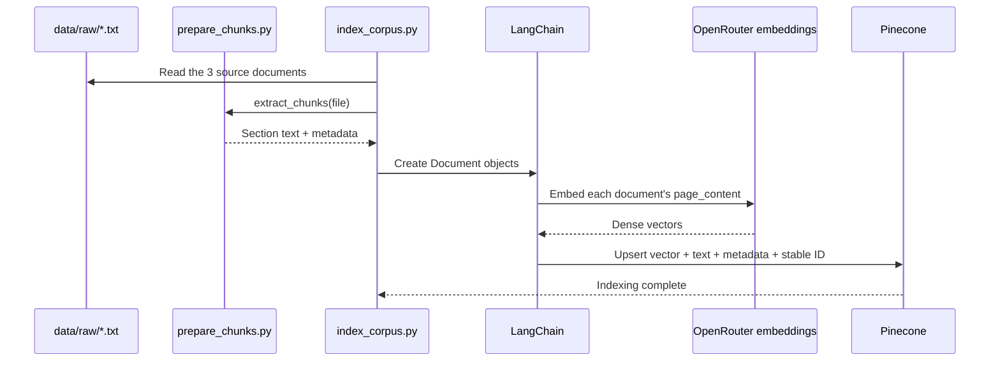
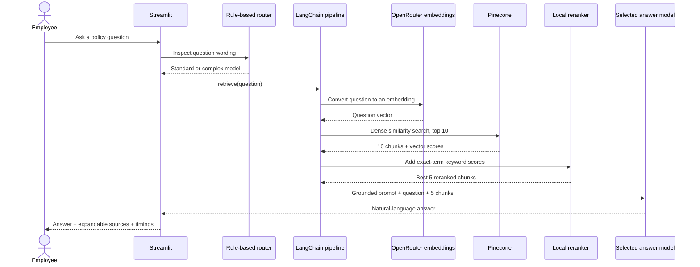
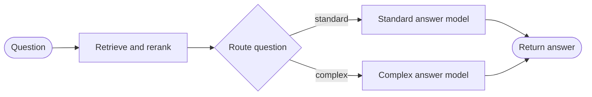

# Enterprise Policy Q&A Architecture

## 1. System Overview

The project has two separate flows:

1. **Ingestion flow:** runs when policy documents need to be indexed or refreshed.
2. **Question-answering flow:** runs every time an employee asks a question in Streamlit.

```mermaid
flowchart LR
    subgraph Offline["A. Ingestion and indexing - run when documents change"]
        RAW["3 policy text files<br/>HR, compliance, technical"]
        CHUNK["Structural chunker<br/>one numbered section per chunk"]
        DOC["LangChain Document<br/>text + metadata"]
        EMBED_DOC["OpenAI-compatible embeddings<br/>through OpenRouter"]
        PC[("Pinecone dense index<br/>26 policy chunks")]

        RAW --> CHUNK --> DOC --> EMBED_DOC --> PC
    end

    subgraph Online["B. Question answering - run for every question"]
        USER["Employee"]
        UI["Streamlit chat UI"]
        ROUTE{"Deterministic<br/>question router"}
        EMBED_Q["Embed question"]
        DENSE["Pinecone semantic search<br/>top 10 candidates"]
        RERANK["Local exact-term reranking<br/>70% vector + 30% keyword"]
        CONTEXT["Top 5 chunks<br/>become prompt context"]
        STANDARD["GPT-4.1-mini<br/>simple questions"]
        COMPLEX["Gemini 3.7 Flash<br/>complex questions"]
        ANSWER["Grounded answer<br/>with policy-section citations"]

        USER --> UI --> ROUTE
        ROUTE -->|standard| STANDARD
        ROUTE -->|complex| COMPLEX
        UI --> EMBED_Q --> DENSE
        PC --> DENSE
        DENSE --> RERANK --> CONTEXT
        CONTEXT --> STANDARD
        CONTEXT --> COMPLEX
        STANDARD --> ANSWER --> UI
        COMPLEX --> ANSWER
    end
```

The model router and retrieval run independently. The router chooses **which answer model**
will write the response; retrieval chooses **which policy evidence** that model receives.

## 2. Ingestion Flow: Document to Pinecone

### What is stored in Pinecone

Each Pinecone record contains:

- A dense embedding vector for semantic similarity.
- The original section text used to generate the embedding.
- Metadata such as source file, department, document version, section number, section title,
  and subsection titles.
- A stable ID such as `hr-4.2-section-4`.

Pinecone does not write the final employee answer. It stores and retrieves evidence.

## 3. Online Flow: Question to Answer

### One question, step by step

1. Streamlit receives the employee's question.
2. A local rule-based router selects the standard or complex answer model. This adds no LLM
   call and therefore almost no latency or model cost.
3. LangChain's embedding client converts the question into a dense vector through OpenRouter.
4. LangChain's Pinecone vector store asks Pinecone for the 10 most similar chunks.
5. Local Python code calculates exact-word overlap for each candidate.
6. The code combines the Pinecone score (70%) and keyword score (30%), then keeps 5 chunks.
7. The selected chat model receives the question, grounded-answer instructions, and 5 chunks.
8. Streamlit displays the answer, retrieved sections, route reason, and timing.

## 4. Where LangChain Is Used

LangChain is already an active part of both project flows.

| LangChain component | Project use | Location |
| --- | --- | --- |
| `Document` | Wraps each chunk as text plus metadata before indexing | `src/index_corpus.py` |
| `OpenAIEmbeddings` | Embeds policy chunks and employee questions through OpenRouter | `src/index_corpus.py`, `src/rag_pipeline.py` |
| `PineconeVectorStore` | Upserts documents and performs semantic similarity search | `src/index_corpus.py`, `src/rag_pipeline.py` |
| `ChatOpenAI` | Calls the selected answer model through OpenRouter | `src/rag_pipeline.py` |
| Structured output | Converts experimental evidence extraction into Pydantic objects | `src/rag_pipeline.py` |

The project uses **LangChain primitives**, but it does not currently use an LCEL chain. The
steps are composed with ordinary Python functions, which is valid LangChain usage and keeps
the Week 2 implementation easy to inspect.

## 5. Where LangGraph Is Used

LangGraph now orchestrates every Streamlit question. Its typed `RAGState` carries the question,
retrieved evidence, route, route reason, final answer, and timings between nodes.

The implemented graph is:

The graph is built and compiled in `src/rag_graph.py`. LangGraph controls execution order and
the conditional model branch, while the existing LangChain functions still perform retrieval
and answer generation. It does not add another model call.

A future extension could add an evidence-sufficiency or verification node, but that is not part
of the current graph because it would need a reliable confidence rule and additional evaluation.

## 6. Technology Responsibilities

| Technology | Responsibility | What it does not do |
| --- | --- | --- |
| Streamlit | Chat interface and session display | Does not retrieve or generate policy facts |
| Python | Chunking, routing, reranking, orchestration, evaluation | Does not provide semantic understanding by itself |
| LangChain | Standard interfaces for documents, embeddings, Pinecone, and chat models | Does not automatically create an agent or graph |
| OpenRouter | OpenAI-compatible gateway to embedding and chat models | Does not store the policy corpus |
| Pinecone | Stores vectors and retrieves semantically similar chunks | Does not compose the final answer |
| Answer model | Reads retrieved evidence and writes the grounded response | Must not answer beyond the provided chunks |
| LangGraph | Carries request state and branches to the standard or complex model | Does not replace LangChain retrieval or prompting |
